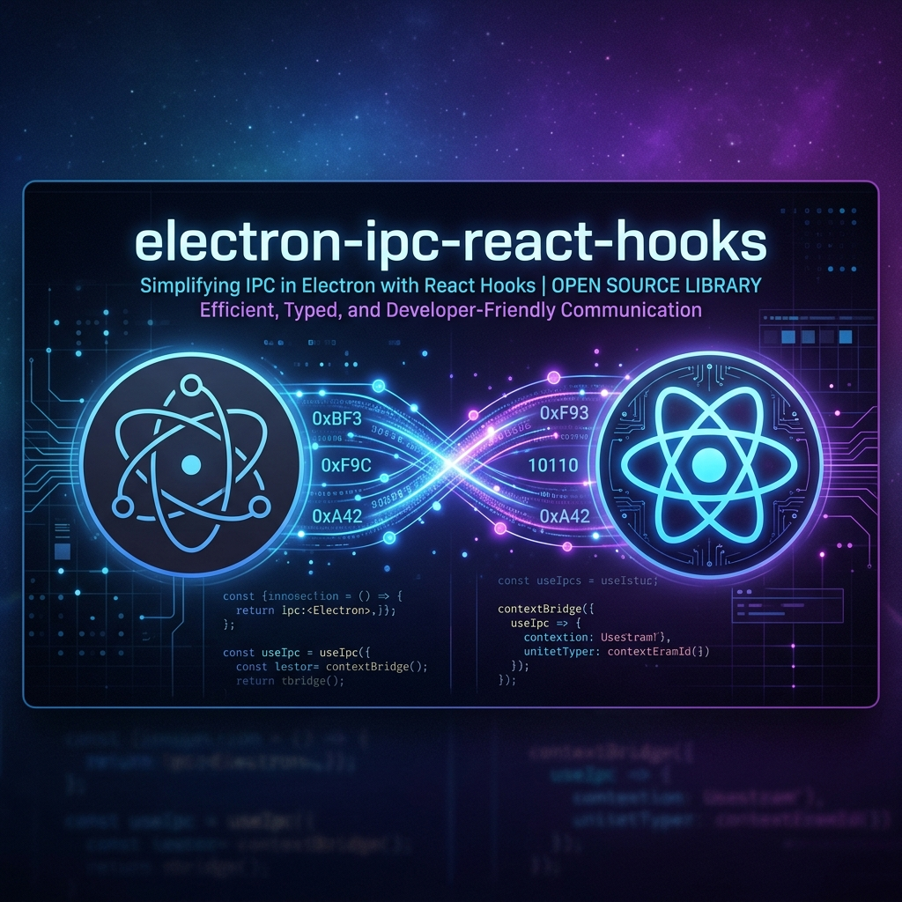

<div align="center">
  

  <br />
  <br />

  [](https://www.npmjs.com/package/electron-ipc-react-hooks)
  [](https://opensource.org/licenses/MIT)
  [](https://www.typescriptlang.org/)
  [](https://trpc.io)

  <p><h3><b>100% Type-Safe • Zero Code Gen • Seamless React Query Integration</b></h3></p>
</div>

---

**Electron-IPC-React-Hooks** is a state-of-the-art Inter-Process Communication (IPC) boundary orchestrator for Electron Javascript Applications. It provides a **tRPC-inspired architectural pattern** that delivers end-to-end type safety between your Main (Node.js) and Renderer (React) processes without running expensive compiler CLI tools or configuring complex typing files natively.

> [!NOTE] 
> **The Problem with Legacy Tooling**
> Legacy frameworks (like `electron-reactive-event`) solved type safety via convoluted CLI step generation or highly complex, manually matched `React.Context` bindings. This required redundant schema definitions and wrapping plain `useEffect` functions to try and mock functionality already perfected by data-fetching libraries.

**Our Solution**: You define a native router in the Main Process. The type of that router securely bridges back across the preload context script directly to your renderer inside a **TanStack React Query wrapper**. This provides native `{ data, isLoading, error }` state-management inside React—giving you the most powerful developer experience possible.

---

## 🛠 Features & Technology Stack

The framework leverages modern tools to deliver the fastest and safest developer experience:
* **`Typescript` (End-to-End Type Safety)**: The arguments and returned values of your main process backend handlers instantly manifest into autocomplete suggestions in your React front end.
* **`Zod` Runtime Validation**: Type safety doesn't protect you at runtime. Cross-boundary payloads are vulnerable! Utilizing Zod automatically enforces runtime constraints over the data payloads injected by the Renderer across the bridge.
* **`@tanstack/react-query`**: No more manual loading state indicators, error catches, or repetitive `useEffect` calls in React. The unified `useQuery` / `useMutation` API gives your components absolute control.
* **`Vitest` Integration Capabilities**: Handlers built into your IPC router execute flawlessly in standard Unit Tests, making TDD an absolute breeze.

---

## 📦 Installation

This framework leverages `zod` and `@tanstack/react-query` as core peer dependencies:

```bash
npm install electron-ipc-react-hooks zod @tanstack/react-query
npm install -D typescript
```

---

## 📖 Deep Dive Usage Guide

### 1. Build The Main Router (`src/main.ts`)

You create your "backend" endpoints inside the Main Process environment utilizing the routing builder block. This is identical to spinning up an Express or tRPC router!

```typescript
import { initIpc, bindIpcRouter } from 'electron-ipc-react-hooks';
import { ipcMain } from 'electron';
import { z } from 'zod';
import { fetchSecureDatabaseRecord } from './custom-db-logic';

const t = initIpc();

const appRouter = t.router({
  // -------------------------------------------------------------
  // DEFINING A "QUERY" (Used for fetching data from the Main process)
  // -------------------------------------------------------------
  getUserProfile: t.procedure
    // Zod enforces input is a string that looks like an email:
    .input(z.string().email()) 
    .query(async ({ input }) => {
      // Logic inside the Node.js main process environment!
      const user = await fetchSecureDatabaseRecord(input);
      return { id: user.uuid, name: user.displayName, role: user.role };
    }),

  // -------------------------------------------------------------
  // DEFINING A "MUTATION" (Used for altering state or saving data)
  // -------------------------------------------------------------
  saveSettings: t.procedure
    .input(z.object({ theme: z.enum(['dark', 'light']), notifications: z.boolean() }))
    .mutation(async ({ input }) => {
      // Modify a local persistent settings file, etc.
      console.log(`Setting theme to ${input.theme}`);
      return { success: true };
    })
});

// IMPORTANT: Export ONLY the Type of your router! This allows your React 
// frontal code to see the backend footprint without leaking Node.js dependencies!
export type AppRouter = typeof appRouter;

// Finally, connect your router to the core Electron instance
bindIpcRouter(ipcMain, appRouter);
```

### 2. Configure the IPC Bridge (`src/preload.ts`)

Electron's absolute best-practice Context Isolation strategy requires developers to manually wire specific functions through the `contextBridge`. Instead, our tool handles creating a generic `invoke/on` mapping that the React Query boundary hooks straight into.

```typescript
import { contextBridge, ipcRenderer } from 'electron';
import { exposeIpc } from 'electron-ipc-react-hooks/preload';

// Exposes a secure `window.electronIpc` containing generic invoke/on routers
exposeIpc(contextBridge, ipcRenderer);
```

### 3. Consume React Query Hooks (`src/App.tsx`)

Instantiate the framework passing the Type of the router over to the `createReactIpc` proxy.

```tsx
import { createReactIpc } from 'electron-ipc-react-hooks/renderer';
import { QueryClient, QueryClientProvider } from '@tanstack/react-query';
import type { AppRouter } from './main'; // Import the TYPE only!

const ipc = createReactIpc<AppRouter>();

/** Component consuming a QUERY endpoint */
function UserProfile({ email }: { email: string }) {
  // Autocompletion will confirm `.getUserProfile` exists!
  // Type Safety natively flags that `useQuery` expects a valid email string.
  const { data, isLoading, error } = ipc.getUserProfile.useQuery(email, {
      staleTime: 60000, 
      refetchOnWindowFocus: true
  });

  if (isLoading) return <div className="spinner">Fetching DB...</div>;
  if (error) return <div className="error-card">Failed to fetch: {error.message}</div>;

  return <div>Welcome back, {data.name}!</div>;
}

/** Component consuming a MUTATION endpoint */
function SettingsPanel() {
  // Autocomplete sees that saveSettings exists and expects the theme/notifications object
  const mutation = ipc.saveSettings.useMutation({
    onSuccess: (data) => console.log('Saved successfully', data),
    onError: (err) => console.error('Failed to change theme', err)
  });

  return (
    <button onClick={() => mutation.mutate({ theme: 'dark', notifications: false })}>
      {mutation.isPending ? 'Saving...' : 'Switch to Dark Mode'}
    </button>
  );
}

const queryClient = new QueryClient();

export default function App() {
  return (
    <QueryClientProvider client={queryClient}>
      <UserProfile email="test@sorrell.sh" />
      <SettingsPanel />
    </QueryClientProvider>
  )
}
```

---

## ⚡ Advanced Features (v1.1)

### 1. Middleware Support
Implement cross-cutting concerns (logging, auth, performance) using the `.use()` pipeline. Middlewares can intercept inputs, modify context, or block execution.

```typescript
const t = initIpc();

const loggingMiddleware = t.middleware(async ({ next, path, type }) => {
  const start = Date.now();
  const result = await next();
  console.log(`[IPC] ${path} (${type}) took ${Date.now() - start}ms`);
  return result;
});

const protectedProcedure = t.procedure.use(loggingMiddleware);

const appRouter = t.router({
  getSensitiveData: protectedProcedure.query(() => ({ secret: '42' })),
});
```

### 2. Context Injection
Inject Electron events or authenticated user data into every procedure. Define the context type in `initIpc` and provide a creator function in `bindIpcRouter`.

```typescript
// main.ts
type Context = { event: IpcMainInvokeEvent; user?: string };
const t = initIpc<Context>();

const appRouter = t.router({
  whoami: t.procedure.query(({ ctx }) => ctx.user || 'Guest'),
});

bindIpcRouter(ipcMain, appRouter, async (event) => ({
  event,
  user: await authenticate(event), // Custom auth logic
}));
```

### 3. Nested Sub-Routers
Organize large API surfaces into logical namespaces. The framework handles recursive path resolution automatically.

```typescript
const systemRouter = t.router({
  getInfo: t.procedure.query(() => ({ platform: process.platform })),
});

const appRouter = t.router({
  system: systemRouter, // Nested at .system.getInfo
  echo: t.procedure.input(z.string()).query(({ input }) => input),
});
```

### 4. Structured Error Handling (`IpcError`)
Throw structured errors in the Main process and catch them natively in React with `code` and `data` metadata.

```typescript
// main.ts
import { IpcError } from 'electron-ipc-react-hooks';

const appRouter = t.router({
  danger: t.procedure.query(() => {
    throw new IpcError('Unauthorized access', 'UNAUTHORIZED', { reason: 'Invalid token' });
  }),
});

// renderer.ts (React)
const { error } = ipc.danger.useQuery();
if (error instanceof IpcError) {
  console.log(error.code); // 'UNAUTHORIZED'
  console.log(error.data); // { reason: 'Invalid token' }
}
```

---

## ⚡ Handling Real-Time Streams (Subscriptions)

One critical pain point with Electron IPC is subscribing bidirectional streams or Main-driven continuous events without writing tedious `ipcRenderer.on` triggers mixed with messy `useEffect` cleanup procedures.

With `electron-ipc-react-hooks`, you can natively subscribe directly inside your Main process router via the framework. E.g.: Downloading a file to disk and displaying the progress inside React instantly.

```typescript
// main.ts
const appRouter = t.router({
  onDownloadProgress: t.procedure
    .subscription(async ({ emit }) => {
        // Assume NativeDownloadHandler is some Node script piping out data chunks
        NativeDownloadHandler.on('progress', (pct) => emit(pct));
    })
})
```

React Query's robust background mechanisms guarantee memory leaks across the Javascript event loops are contained and removed effectively!

---

## Unit Testing Strategy
Because your Main Handlers detach into a unified `AppRouter` object constructed inside of `main.ts`, implementing test-driven development (TDD) via software like **Vitest** is native. 

Simply bypass Electron IPC entirely, mock inputs, and trigger functions across the pure JSON object map.

```typescript
import { expect, test } from 'vitest';
import { appRouter } from './main';

test('Zod strictly blocks malformed profiles', async () => {
    // Should throw a Zod error due to passing a number down into the string/email pipeline
    await expect(appRouter.getUserProfile({ input: 12345 })).rejects.toThrow();
});
```

---

## 🚀 Example Application

A fully working Electron + Vite + React example app lives in the [`/example`](./example/) directory.
It demonstrates all three IPC patterns — query, mutation, and error handling — in a running desktop application.

### Running the example

```bash
cd example
npm install
npm run build
npx electron .
```

The example features:
- **System Context** — a `useQuery` that fetches real `process.platform`, Electron version, Node version, etc. from the main process
- **IPC Mutation** — a `useMutation` that sends text to the main process, waits 500ms, and returns the reversed string (proving async round-trip works)
- **Error Boundaries** — a mutation that intentionally throws inside the main process and surfaces the error cleanly through React Query's `error` state, with no uncaught promise rejections

### Example tech stack

| Layer | Tool |
|---|---|
| Desktop shell | [Electron](https://www.electronjs.org/) |
| Bundler | [Vite](https://vitejs.dev/) + [vite-plugin-electron](https://github.com/electron-vite/vite-plugin-electron) |
| UI framework | [React 19](https://react.dev/) |
| IPC layer | `electron-ipc-react-hooks` (this library, linked via `file:..`) |

---

## 🔧 Troubleshooting

### Duplicate React / `useContext is null` crash

When consuming this library via a local `file:` link (e.g. `"electron-ipc-react-hooks": "file:.."`), npm may install a second copy of `react` and `@tanstack/react-query` inside the library's `node_modules`. This causes React's context system to fail with:

```
TypeError: Cannot read properties of null (reading 'useContext')
```

**Fix** — add `resolve.dedupe` and explicit aliases to your `vite.config.ts`:

```ts
import { resolve } from 'path'

export default defineConfig({
  resolve: {
    dedupe: ['react', 'react-dom', '@tanstack/react-query'],
    alias: {
      'react': resolve('./node_modules/react'),
      'react-dom': resolve('./node_modules/react-dom'),
      '@tanstack/react-query': resolve('./node_modules/@tanstack/react-query'),
    }
  },
  // ...
})
```

This pins all React imports to your app's `node_modules`, eliminating the duplicate instance.

---

### Chromium disk cache errors on Windows

When launching with `npx electron .`, you may see repeated errors like:

```
[ERROR:disk_cache.cc:284] Unable to create cache
[ERROR:gpu_disk_cache.cc:725] Gpu Cache Creation failed: -2
```

These occur because multiple Electron processes share the same default `userData`/cache path and Windows file locking prevents concurrent writes.

**Fix** — call `app.setPath()` **before** `app.whenReady()` in your `main.ts` to point Electron at a dedicated, writable directory:

```ts
import { app } from 'electron'
import { join } from 'path'
import * as os from 'os'

// Must be called before app.whenReady()
app.setPath('userData', join(os.homedir(), '.your-app-name'))

app.whenReady().then(() => { /* ... */ })
```

---

<div align="center">
  <sub>Built to exponentially expand the boundaries of the Electron developer experience.</sub>
</div>
